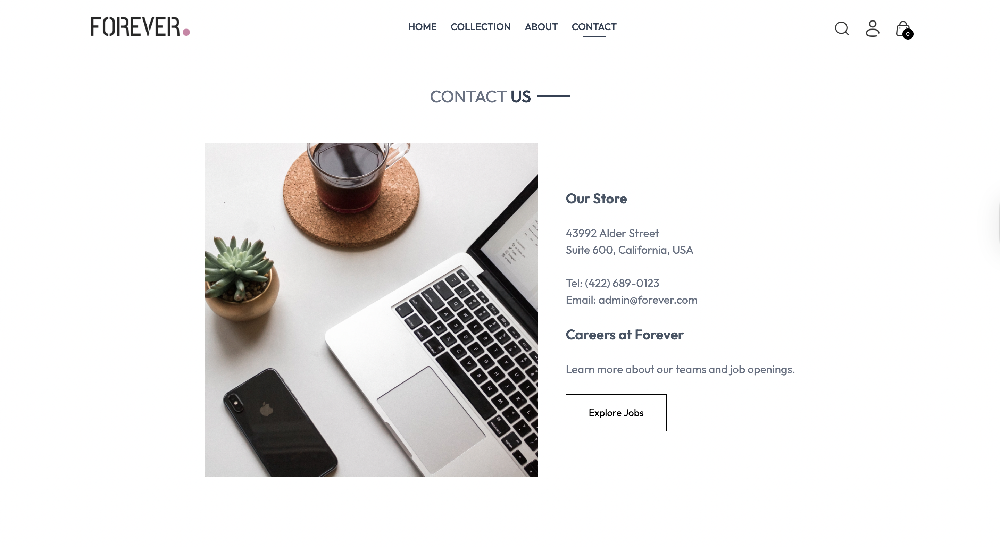
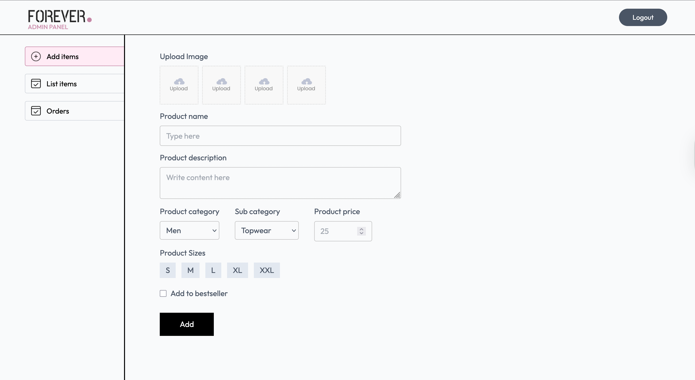

# E-Commerce App

A full-stack e-commerce application built using GreatStack, following the [YouTube tutorial – GreatStack E-commerce Tutorial](https://www.youtube.com) _(link to the actual video)_ with step-by-step guidance.

## Table of Contents

- [Overview](#overview)
- [Features](#features)
- [Tech Stack](#tech-stack)
- [Getting Started](#getting-started)
  - [Prerequisites](#prerequisites)
  - [Installation](#installation)
  - [Running the App](#running-the-app)
- [Environment Variables](#environment-variables)
- [Project Structure](#project-structure)
- [Contributing](#contributing)
- [License](#license)
- [Contact](#contact)

---

## Overview

This app showcases a straightforward yet robust e-commerce platform featuring product browsing, shopping cart functionality, and checkout flow. Built from the ground up with GreatStack tools, it’s an excellent demonstration of modern RESTful API design and frontend development.

## Features

- User authentication (sign-up, login, logout)
- Product catalog with category filters and search
- Shopping cart management
- Checkout and order processing (mock or real integration)
- Responsive design for mobile and desktop views

## Tech Stack

- **Frontend**: React, Redux (or Context API), CSS Modules / Styled-Components
- **Backend**: Node.js, Express, GreatPlatform (GreatStack’s backend library)
- **Database**: MongoDB (via Mongoose) or PostgreSQL
- **Authentication**: JWT or GreatAuth
- **Deployment**: Vercel for frontend, Heroku / Vercel for backend

_(Modify to reflect your actual tech stack.)_

## Getting Started

### Prerequisites

Ensure you have the following installed:

- Node.js ≥ 14
- npm or yarn
- (Optional) MongoDB or PostgreSQL running locally
- (Optional) Vercel CLI or Heroku CLI for deployment

### Installation

1. **Clone the repository**

   ```bash
   #Clone Repo
   git clone https://github.com/RunyararoMucheche/ecommerce_app.git
   cd ecommerce_app
   ```

2. **Run Frontend and Backend**

   ```
   #Run Backend code
   cd backend
   npm install

   #Run Frontend code
   cd ../frontend
   npm install

   #Run Frontend code for admin
   cd ../admin
   npm install
   ```

3. **Set up environment variables**

   ```
   #Backend environment variables
   MONGODB_URI = your_mongodb_uri
   CLOUDINARY_API_KEY = your_cloudinary_api_key
   CLOUDINARY_SECRET_KEY = your_cloudinary_secret_key
   CLOUDINARY_NAME = your_cloudinary_name
   JWT_SECRET = your_jwt_secret
   ADMIN_EMAIL = admin_email
   ADMIN_PASSWORD = admin_password
   STRIPE_SECRET_KEY = your_stripe_secret_key
   RAZORPAY_KEY_SECRET = your_razorpay_key_secret
   RAZORPAY_KEY_ID = your_razorpay_key_id

   #Frontend environment variables
   VITE_BACKEND_URL = your_backend_url
    VITE_RAZORPAY_KEY_ID = your_razorpay_key_id

    #Admin environment variables
   VITE_BACKEND_URL = your_backend_url
   ```

## Screenshots








## About the Author

**Runyararo Mucheche**

- GitHub: [RunyararoMucheche](https://github.com/RunyararoMucheche)
- Upwork Portfolio: [Runyararo Mucheche](https://www.upwork.com/freelancers/~013a0b5a6014152ba5)
- LinkedIn: [Runyararo Mucheche](https://www.linkedin.com/in/runya-mucheche/)
